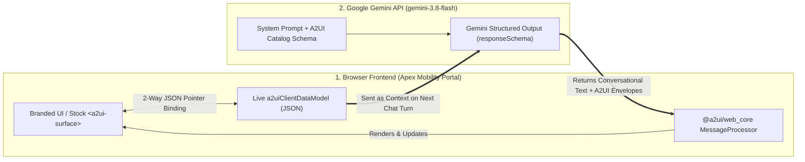

# Exploring This Repository: How Gemini & A2UI v0.9.1 Work Together

Welcome! This guide provides a **high-level architectural entry point** to understand how **Google Gemini (`gemini-3.8-flash`)** and the open-source **[A2UI (Agent-to-User Interface) v0.9.1 protocol](https://a2ui.org/specification/v0.9.1-a2ui/)** work together in this repository.

---

## 1. The Core Mental Model (In 60 Seconds)

Traditional chatbots only stream **plain text**. Conversely, having an LLM generate raw HTML/JavaScript directly into a browser introduces security (XSS), styling, and maintenance risks.

**A2UI solves this by separating *Agent Intent (JSON)* from *Frontend Rendering (Component Catalog)*:**

1. **The Frontend Owns the Component Catalog**: The browser registers a trusted catalog of UI primitives (`Card`, `Column`, `Row`, `Text`, `Image`, `ChoicePicker`, `Slider`, `DateTimeInput`, `TextField`, `CheckBox`, `Button`).
2. **Gemini Speaks in Declarative A2UI Envelopes**: When a customer asks to compare vehicles or book a test drive, **Gemini (`gemini-3.8-flash`)** returns both a natural-language reply *and* structured A2UI JSON messages (`createSurface`, `updateComponents`, `updateDataModel`).
3. **Two-Way State Synchronization (`a2uiClientDataModel`)**: When the customer interacts with the UI (clicks a trim chip, drags a slider, or types their email), the browser updates its local JSON Data Model via JSON Pointers (`/booking/dealerId`, `/driver/email`). On the next chat turn, that JSON state is sent back to Gemini—allowing Gemini to mutate the existing form **in-place** (`updateDataModel`) without reloading the UI or losing typed inputs.

---

## 2. Where What Is in the Codebase

| File / Section | What It Does & What to Look For |
| :--- | :--- |
| **[`package.json`](./package.json)** & **[`scripts/bundle-a2ui-sdk.js`](./scripts/bundle-a2ui-sdk.js)** | **Public Open-Source A2UI SDK Setup**: Pulls the official `@a2ui/web_core` (`0.9.2`) and `@a2ui/lit` (`0.9.3`) packages from public npm and bundles them into `a2ui_public_sdk.js` (`window.RealA2UI`). |
| **[`app.js`](./app.js) — Sections 2 & 4** *(`realA2uiProcessor` & `processA2uiEnvelope`)* | **The A2UI Engine Integration**: Initializes `new window.RealA2UI.MessageProcessor([modernSolidCat, basicCat])`. Every `createSurface`, `updateComponents`, and `updateDataModel` JSON envelope is validated and stored in `realA2uiProcessor.model`. |
| **[`app.js`](./app.js) — Sections 3 & 5** *(`evaluateDynamic` & `renderSurfaceInDOM`)* | **JSON Pointers, Local Validation (`checks`) & Catalog Toggle**: Resolves data bindings (`{"path": "/booking/durationMins"}`), evaluates browser-side validation rules (`required`, `email`, `regex`) at 60fps, and powers the **`🔬 Inspect Stock <a2ui-surface> Web Component`** toggle button. |
| **[`app.js`](./app.js) — Sections 7 & 8** *(`runTurn1` $\rightarrow$ `runTurn4`)* | **The 4-Turn Automotive Storyboard**: Demonstrates the complete lifecycle of an A2UI conversation: • **Turn 1**: `createSurface` + `updateComponents` (Fleet Comparison Grid) • **Turn 2**: Dynamic 36-node Test Drive Configurator Form • **Turn 3**: In-place `updateDataModel` patch triggered from chat • **Turn 4**: Client `action` submission & Digital Wallet Pass |
| **[`app.js`](./app.js) — Section 10** *(`invokeLiveGeminiForA2ui`)* | **Live Google Gemini (`gemini-3.8-flash`) + A2UI `responseSchema`**: Sends the user's chat message + the live `a2uiClientDataModel` JSON snapshot to `generativelanguage.googleapis.com` using Gemini Structured Outputs, and translates Gemini's JSON response directly into live A2UI `updateDataModel` mutations. |
| **[`index.html`](./index.html)** & **[`styles.css`](./styles.css)** | **Split-Screen UI & Slide-In Inspector**: Renders the customer showroom chat on the left and the slide-in **"Behind the Curtains" A2UI Inspector** drawer on the right. |

---

## 3. Recommended 5-Minute Walkthrough

When you run the app (`npm start` $\rightarrow$ `http://localhost:8090`), try these 5 steps in order:

1. **Compare Branded vs. Stock `<a2ui-surface>` Rendering**:
   * On the Turn 1 Vehicle Comparison card, click **`🔬 Inspect Stock <a2ui-surface> Web Component`** in the top-right header of the card.
   * You will see the **raw, unstyled `<a2ui-surface>` Lit Web Component** from `@a2ui/lit` rendering the exact same `SurfaceModel` JSON. Click it again to switch back to the **Apex Mobility Branded Catalog**.
2. **Open the Booking Form (Turn 2) & Slide In "Behind the Curtains"**:
   * Click **"Book Apex Aero GT Coupé →"** on the first vehicle card to mount the interactive Test Drive Booking Form.
   * Now click **`⚡ Show "Behind the Curtains" ◀`** in the top-right navbar to slide in the technical A2UI Inspector drawer.
3. **Test Two-Way Data Binding (Left UI $\rightarrow$ Right Data Model)**:
   * Type into the **Driver Full Name** or **Email** field on the left, or drag the **Duration Slider**.
   * Watch the **`Live 2-Way Data Model (a2uiClientDataModel)`** JSON in the right drawer update instantaneously on every keystroke—and watch the **`Local A2UI v0.9.1 Validation Checks`** evaluate locally in the browser.
4. **Trigger an In-Place `updateDataModel` Mutation (Turn 3)**:
   * Click **Turn 3 (`Chat Mutates Form Live`)** (or click one of the **`⚡ Push`** buttons in the right drawer).
   * Notice how the form updates its vehicle, dealership, and duration **in-place** via a lightweight `updateDataModel` JSON patch without resetting the driver contact fields you already typed!
5. **Connect a Live Gemini API Key (`gemini-3.8-flash`)**:
   * Click **`✦ Gemini 3.8 Flash: Connect Key`** in the top navbar and paste a Google AI Studio API key.
   * Type any natural-language instruction in the bottom chat box (e.g., *"Switch me to the Horizon 7-Seater at the Airport Lounge for 120 minutes and set my name to Sarah Jenkins"*).
   * Gemini will read your current `a2uiClientDataModel`, reply in chat, and patch the live form via A2UI `updateDataModel`—and you can inspect the exact Gemini HTTP payload in the **`✦ Last Gemini Structured Output`** card on the right!
